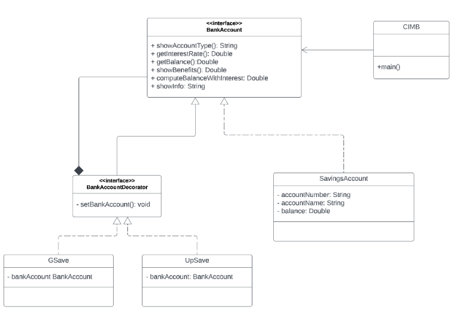

# Lab Assignment 7
This is Laboratory Assignment 7 for the course, Software Engineering 1, taken during the First Semester of Academic Year, 2025-2026, at New Era University.
## Problem Statement
**Background:**

CIMB is a digital bank that offers GSave and UpSave savings accounts.   As with a typical Savings Account, it contains accountNumber, accountName, and a balance for that account.

The typical savings account offers an interest rate of 1%.
The benefits of the typical savings account is the same with the "Standard Savings Account" as compared to other banks.

The GSave account offers an interest rate of 2.5%.
Benefits include the "Standard Savings Account" plus access to "GCash transfer".

The UpSave account offers the highest interest rate of 4.0%.
Benefits include the "Standard Savings Account" plus "with Insurance".

**Methods Description:**
<ol>
  <li><b>showAccountType()</b> - Either returns "Savings Account", "GSave" or "UpSave."</li>
  <li><b>getInterestRate()</b> - Either returns 1% for Savings Account; 2.5% for GSave; 4.0% UpSave</li>
  <li><b>getBalance()</b> - Returns the balance of the account set.</li>
  <li><b>showBenefits()</b> - Either returns "Standard Savings Account" for Savings Account; benefits offered by savings account + "GSave Transfer"; benefits offered by savings account + "With Insurance";
</li>
  <li><b>computeBalanceWithInterest()</b> - Returns new balance by computing the balance plus the interest depending on the interest rate.
</li>
  <li><b>showInfo()</b> - Returns details of account number, account name, and balance.</li>
</ol>

**BankAccountDecorator** must be an interface.

## Class Diagram

